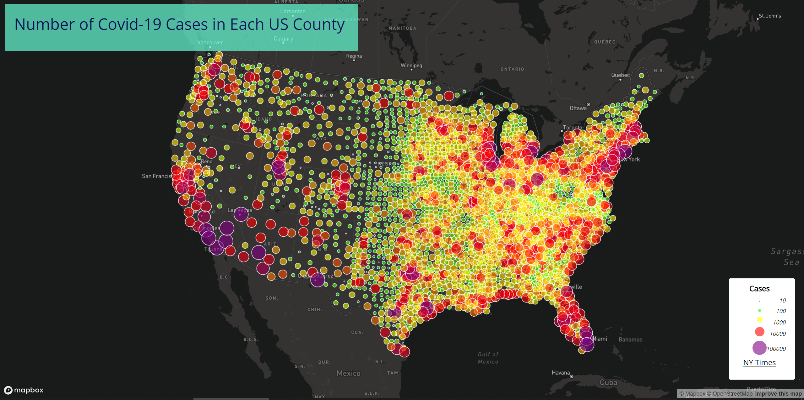
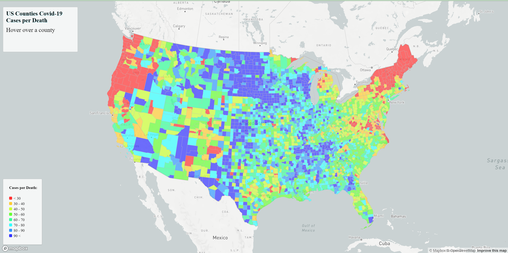

# 2020 US Covid-19 Cases and Rate of Cases-Per-Death

## This repository contains the code for the following two maps:
-  **Proportional Symbol Map of US Covid-19 Cases per County:** [here](https://tj717.github.io/US-Covid-19-Rates-and-Cases/map2.html)
-  **Choropleth Map of US Covid-19 Cases per Death in each County:** [here](https://tj717.github.io/US-Covid-19-Rates-and-Cases/map1.html).

#### This project aims to visualize Covid-19's impact on 2020 America and highlight the county differences. From the maps, we can see the east and west coast are under the most impact and has the highest number of cases compared to the rest of America.

### The primary function in US Covid-19 Cases per County
- fetches data from the assets folder.
- generates a layer of circles with a radius proportional to a range of cases.
- creates popups with the county name and number of cases.
- iterates through the sizes of the circles and creates a legend for each size.

### The primary function in US Covid-19 Cases per Death in each County
- fetches data from the assets folder.
- generates a layer of choropleth with a color corresponding to a range of cases per death.
- creates a legend for the choropleth.
- produces a mouse hover event showing the county name and number of cases per death.

### Libraries in use: [Mapbox GL JS](https://docs.mapbox.com/mapbox-gl-js/api/)
---
### Data used: 
the 2020 COVID-19 case/death data are originally from [The New York Times](https://github.com/nytimes/covid-19-data/blob/43d32dde2f87bd4dafbb7d23f5d9e878124018b8/live/us-counties.csv). The population data used for calculating the case rates are from the [2018 ACS 5-year estimates](https://data.census.gov/cedsci/table?g=0100000US.050000&d=ACS%205-Year%20Estimates%20Data%20Profiles&tid=ACSDP5Y2018.DP05&hidePreview=true). Both data are at the county level. The U.S. county boundary shapefile was downloaded from [the U.S. Census Bureau](https://www.census.gov/geographies/mapping-files/time-series/geo/carto-boundary-file.html). The data was processed by Steven Bao.